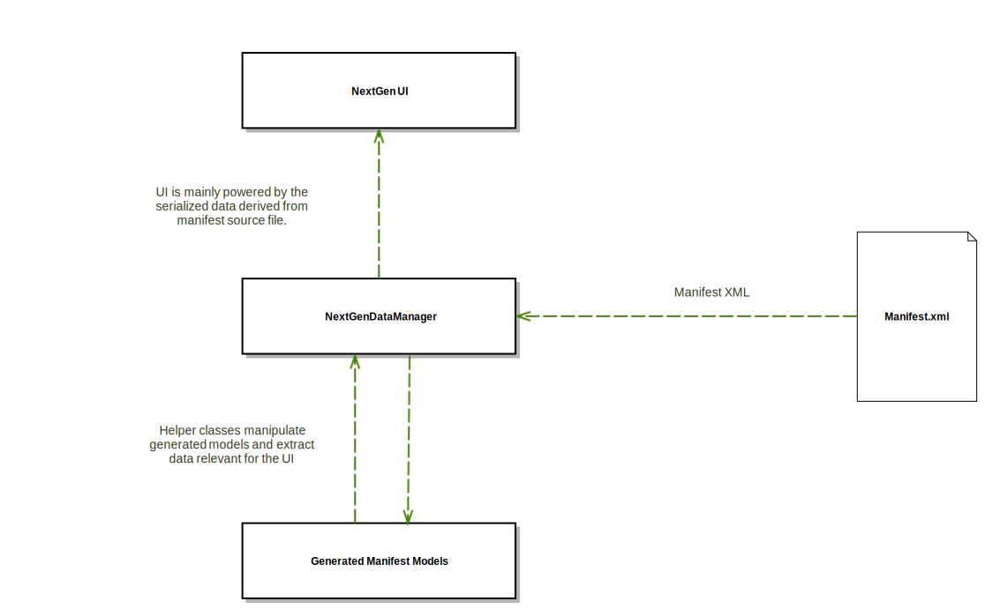
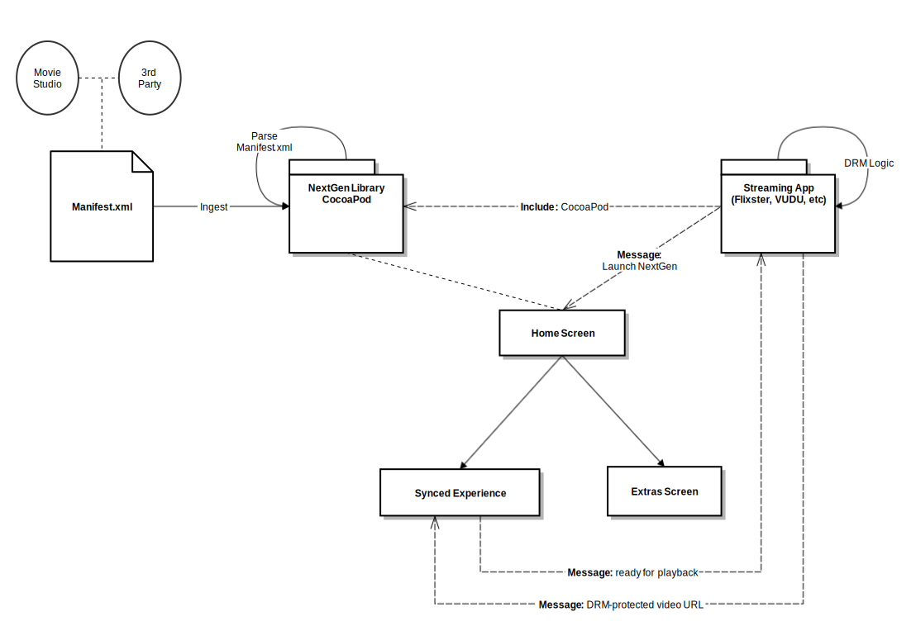

# NextGen Extras

## Table of Contents
1. [Overview](#Overview)
2. [License](#License)
3. [Diagrams](#Diagrams)
4. [How to Get Started](#How-to-Get-Started)


## Overview
NextGen Extras is an _enhanced_ 'extras' experience around user owned content. The goal is to help drive digital ownership of premium content by providing added value to movie fans across the globe. This reference library is built to allow a partner to accelerate their NextGen Extras iPad & Android Tablet implementation.

## License
Warner Bros. is still working on applying a flexible open-source license to this library. Our goal is to make distribution of this code-base modifiable & re-distributable by implementing vendors. WB's legal team is reviewing various open-source licenses to apply to this source code, amongst them is the Apache License, Version 2.0 & MIT License. This will be clarified soon.

## Diagrams
### iPad & Android Tablet Flowchart
A high-level flowchart on how the library operates when embedded in a partner retailer's app.


### Data binding + UI layers
The reference code for iPad & Android Tablets is being built to be modular; e.g. a partner retailer can choose to use just the manifest-to-native data-binding layer and/or the UI layer. Each layer is customizable by retailer is they choose to do so.


### iOS CocoaPods Library Diagram
A iOS specific architecture diagram.


## How to Get Started
### Dependency Management
The iPad & Android Tablet libraries have a few open-source dependencies. [CocoaPods](https://guides.cocoapods.org/using/getting-started.html) can be used to easily set this library up in an existing iOS application, and Gradle can be used to build and link this library to an existing Android application. Both approaches use relative build paths for source code, meaning the source-code itself will not be published to public source control repositories (such as Github / Bitbucket) for CocoaPods to pull from. 

The list of dependencies is not finalized at this time (03/30/2016). 

#### iPad Dependency Licenses
[iPad Dependency Licenses](./Docs/Licenses/opensource-licenses.html)  
See: ./Docs/Licenses/opensource-licenses.html

#### Android Dependency Licenses
To be provided

### Installation
#### Podfile
To integrate NextGen Extras into your Xcode project using [CocoaPods](https://guides.cocoapods.org/using/getting-started.html), specify it in your Podfile:
##### Local Path
```
pod 'NextGenExtras', :path => '~/code/Pods/NextGenExtras'
```
##### Private Repo
Private repositories can be used with CocoaPods. Commit the iOS library to a private Git repo and use the following instructions:
[CocoaPods Private Repo](https://guides.cocoapods.org/making/private-cocoapods.html